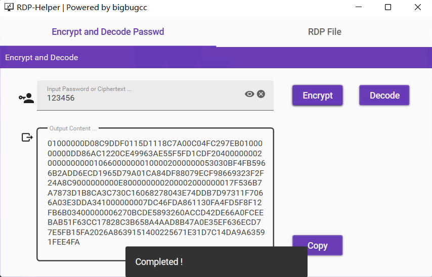
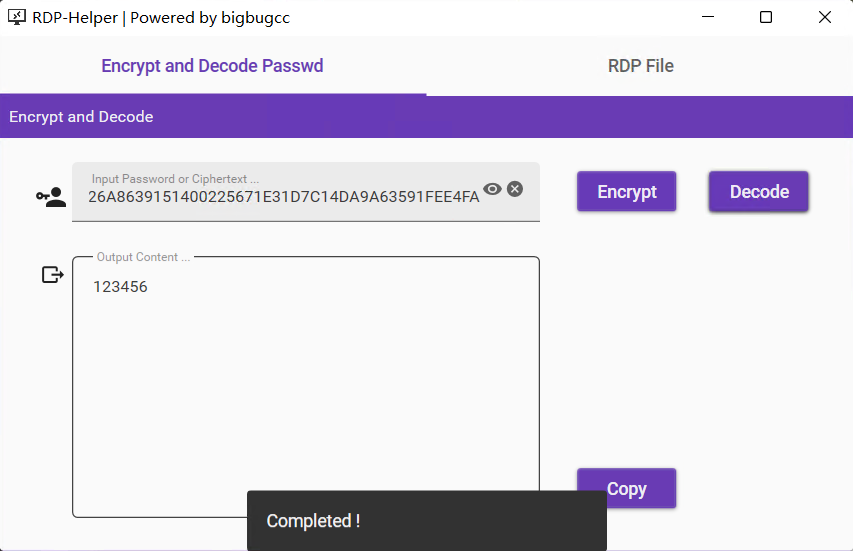

## RDP Helper
This is a simple Windows remote desktop configuration generator, which can be decrypted by the RDP password; and the RDP file can be generated directly according to the requirements options.

## Usage
- [Download](https://github.com/bigbugcc/RDP-Helper/releases)  

### Encrypt

### Decode
